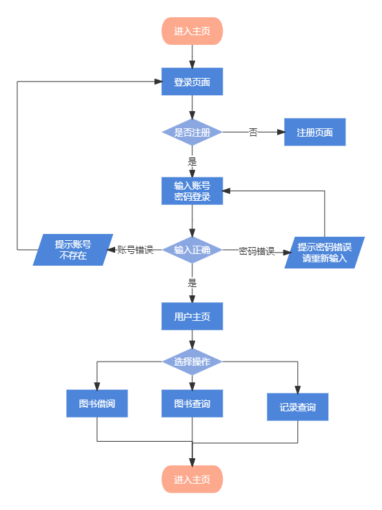
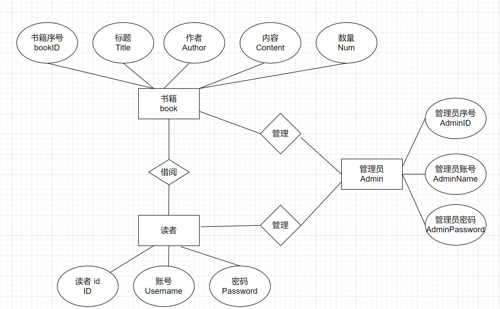
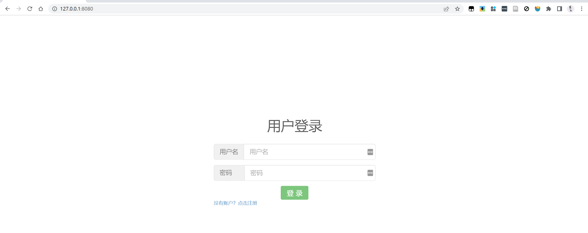
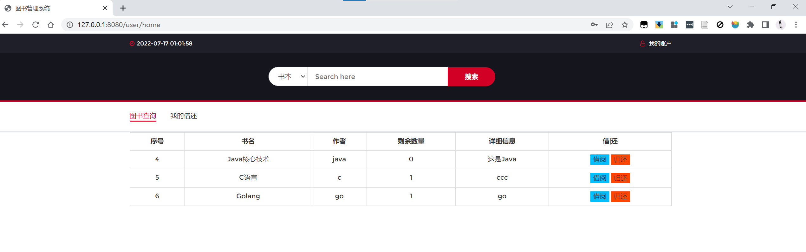
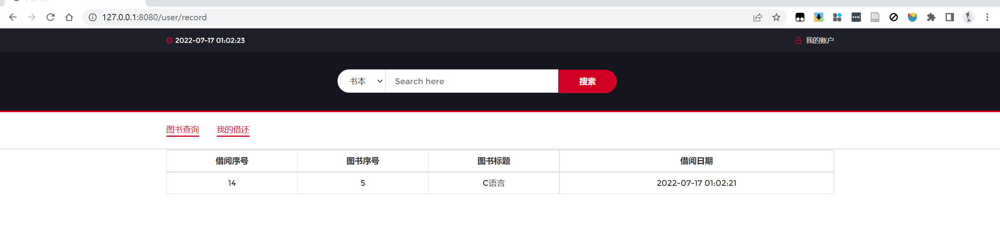
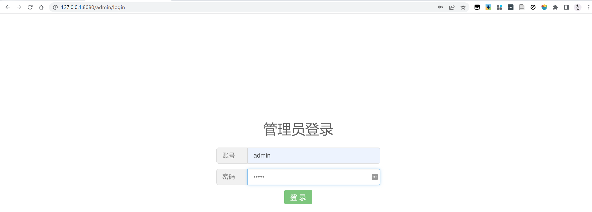
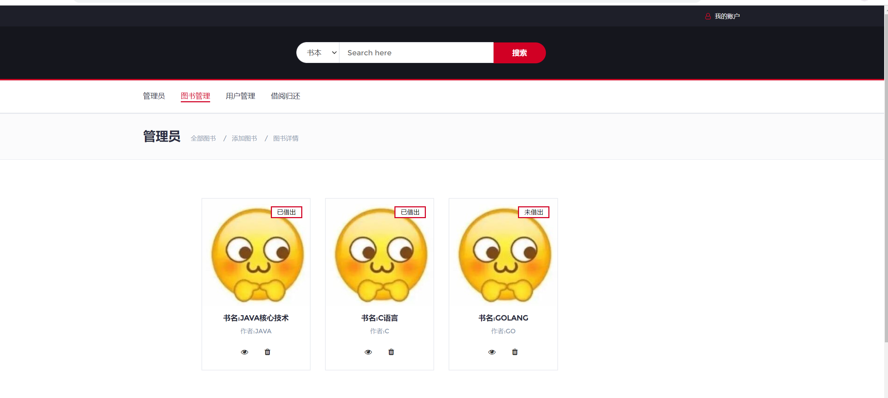
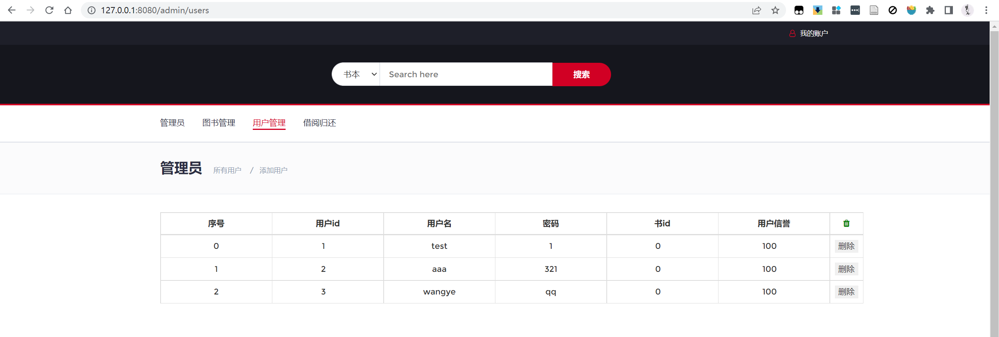

## 一、概述

使用Golang编写的图书管理系统，涉及`gin`+`jwt`+`MySQL`，主要功能如下

* 注册登录
* JWT验证
* 管理员：

  * 用户管理（增删改）
  * 图书管理（增删改查）

* 用户：

  * 图书查询借阅归还
  * 个人借阅记录查询

## 二、系统设计

### 2.1功能流程图

用户分为两类：读者、图书管理员

* 图书管理员可以修改读者信息，修改书目信息，查看所有借还记录等；
* 读者仅可以查询书籍，借阅或归还书籍

以用户为例，流程如下：

先进行登录验证，存在账号则直接进入，否则进行注册；登录成功进入主页面，用户可以选择进行图书的查询，借阅，归还等操作

**管理员和用户流程基本一致，只是多了一些管理模块**

### 2.2 数据库设计

#### 1. 图书书目表tab_book

|名|类型|长度|小数点|NULL|用途|键|
| :--------| :--------| ------| --------| ------| ----------| ----|
|book_id|bigint|20|0|否|图书号|✔|
|title|varchar|20|0|否|书名||
|author|varchar|15|0|否|作者||
|content|varchar|200|0|否|内容||
|number|int|11|0|是|剩余数量||

#### 2. 数据库管理员表tab_admin

|名|类型|长度|小数点|NULL|用途|键|
| :---------| :--------| ------| --------| ------| --------| ----|
|admin_id|bigint|20|0|否|账号|✔|
|password|varchar|15|0|否|密码||
|username|varchar|15|0|是|用户名||

#### 3. 借阅信息表tab_record

|名|类型|长度|小数点|NULL|用途|键|
| :----------| :-------| ------| --------| ------| ----------| ----|
|ser_num|bigint|20|0|否|流水号|✔|
|book_id|bigint|20|0|否|图书号||
|reader_id|bigint|20|0|否|读者号||
|lend_date|date|0|0|是|借出日期||
|back_date|date|0|0|是|归还日期||

#### 4. 用户信息表tab_user

|名|类型|长度|小数点|NULL|用途|键|
| :----------| :--------| ------| --------| ------| ----------| ----|
|reader_id|bigint|20|0|否|读者证号|✔|
|password|varchar|15|0|否|密码||
|username|varchar|15|0|是|用户名||

### 2.3 具体实现

#### 验证登录

这里主要是借助`JWT`进行实现，当成功登录后，生成一个token用于信息保存，后续访问具体页面都需要验证token，否则无法进入；也即实现过滤的功能

代码参考以下仓库：[BGBiao/gin-jwt-token: 使用Golang语言下的Gin框架和jwt-go库实现JWT认证 (github.com)](https://github.com/BGBiao/gin-jwt-token)

#### 管理模块

图书管理、用户管理等，都是一个数据库查询过程，这里直接手写sql语句来实现的；具体语句不在叙述

## 三、功能演示

### 用户操作

#### 登录

#### 查询

#### 记录

### 管理员操作

#### 登录

管理员账号没有提供注册接口，管理员默认账号密码为（admin，admin）

#### 图书管理

#### 用户管理

## 四、参考

1. [BGBiao/gin-jwt-token: 使用Golang语言下的Gin框架和jwt-go库实现JWT认证 (github.com)](https://github.com/BGBiao/gin-jwt-token)
2. [youngsudo/golibrary: go图书管理系统 (github.com)](https://github.com/youngsudo/golibrary)
3. [Gin框架中使用JWT进行接口验证 - 知乎 (zhihu.com)](https://zhuanlan.zhihu.com/p/113376580)
